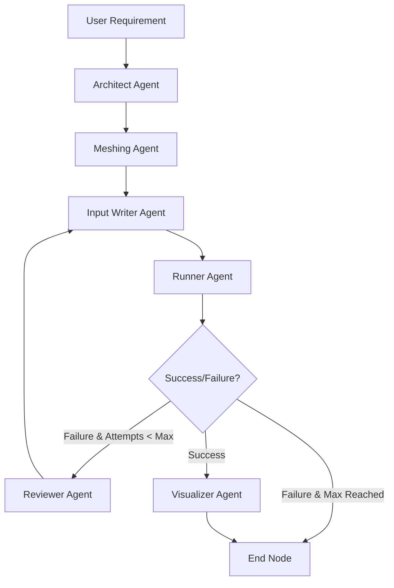

# HarnessFOAM 🌊

<div align="center">

**An End‑to‑End Composable Multi‑Agent Framework for Automating CFD Simulation in OpenFOAM**


[](https://python.org) 
[](https://openfoam.org/) 
[](https://opensource.org/licenses/MIT)

</div>

---

## 🚀 Overview

Computational Fluid Dynamics (CFD) is critical to modern engineering, but the steep learning curve, complex mesh generation, and intricate text-based solver setup in OpenFOAM make it highly labor-intensive. 

**HarnessFOAM** solves this by introducing a modular, composable multi-agent framework built on **LangGraph**. It completely automates the entire end-to-end CFD lifecycle from a single natural-language request (e.g., *"Simulate incompressible flow over a circular cylinder at 2 m/s"*). 

The platform offers a premium real-time Web User Interface, automatic environment provisioning (WSL/Docker/Native), a multi-agent orchestration pipeline, and automated visualization post-processing.

---

## 🖥️ Web User Interface

HarnessFOAM includes a state-of-the-art, zero-dependency HTML/CSS/JS frontend served by a FastAPI backend:


* **Interactive File Explorer** – Instant visualization of the generated folder hierarchy (`0/`, `constant/`, `system/`) and live configuration previews.
* **Console Width Auto-Resize** – Seamless layout adjustment when toggling sidebars or console views using smooth CSS transitions.
* **Real-time API Settings** – Live synchronization of provider parameters (`OPENAI_API_BASE`, `OPENAI_API_KEY`) and dynamic model list fetching.
* **Real-Time Agent Feed** – Interactive logs streaming every step taken by the 6 reasoning agents as the workflow progresses.

---

## 🔄 Composable Multi-Agent Workflow

The system is coordinated via a LangGraph state graph that passes a shared `SimulationState` context dictionary among specialized agents:



1. **State Propagation** – A unified `llm_kwargs` dict is sent across all agents, ensuring runtime model overrides (e.g. `deepseek-v4-flash`, `minimax-m27`, `qwen3.5`) are consistently respected.
2. **Error Feedback Loops** – If a simulation run crashes, the environment logs are routed to the **Reviewer**, which writes suggestions, updates files, and commands the **Input Writer** to recompile config files.

---

## 🤖 Deep-Dive: The 6 AI Agents

Every agent inside HarnessFOAM operates with distinct inputs, toolboxes, and pydantic structured formats:

### 1. Architect Agent (`architect.py`)
* **Role**: Translates user requirements into a file generation plan.
* **Output**: A structured list of target files and directories (e.g. `system/blockMeshDict`, `constant/transportProperties`, `0/U`).
* **Fallback**: Generates a standard set of incompressible Navier-Stokes solver configurations if the LLM fails.

### 2. Meshing Agent (`meshing.py`)
* **Role**: Analyzes spatial layout requirements to choose the most suitable mesh strategy.
* **Logic**: Detects if native `blockMeshDict` is sufficient or if complex geometries (e.g., airfoils, cylinders) require custom `gmsh` scripts.
* **Execution**: Dynamically compiles a Python `gmsh` script, executes it, and converts the mesh output into OpenFOAM format.

### 3. Input Writer Agent (`input_writer.py`)
* **Role**: Generates raw, valid OpenFOAM dictionaries without formatting fences.
* **Technology**: Uses a custom **streaming API connection** to handle long generation windows without timing out, combined with aggressive regex filters to clean output and strip `<think>` tags.
* **Robustness**: Implements connection/read retries with exponential backoffs to deal with unstable API endpoints.

### 4. Runner Agent (`runner.py`)
* **Role**: Formulates execution command pipelines.
* **Output**: Writes the standard `./Allrun` executable. For cloud/HPC environments, it automatically outputs optimized Slurm allocation scripts specifying node bounds and parallel processing commands.
* **Execution**: Manages shell process execution inside native Windows, WSL, or Docker environments.

### 5. Reviewer Agent (`reviewer.py`)
* **Role**: Analyzes build and runtime logs to repair failing simulations.
* **Mechanism**: Leverages Large Vision-Language Models (VLMs) to visually review rendered post-processing plots. If flow physics show anomalies (e.g., flow divergence, incorrect boundary reflection), it overrides boundary conditions or decreases step intervals.

### 6. Visualizer Agent (`visualizer.py`)
* **Role**: Automated post-processing plotting.
* **Execution**: Compiles python scripts using `PyVista` to load OpenFOAM VTK results, applies contour filters, renders velocity/pressure fields, saves the output to a `.png` file, and streams it back to the client interface.

---

## 🔧 Installation & Quick Start

### Prerequisites
* **Python**: `3.10` or above.
* **OpenFOAM**: Installed locally or inside WSL. Alternatively, a running Docker daemon. (If missing, the UI installer can automatically provision OpenFOAM inside WSL).

### Setup
```bash
# 1. Clone the project repository
git clone https://github.com/isabecurtis023-lang/HarnessFOAM.git
cd HarnessFOAM

# 2. Install package in editable mode along with dev options
pip install -e .[dev]

# 3. Create and configure your environment variables
cp .env.example .env
```

Ensure your `.env` contains valid OpenAI or compatible (such as CSTCloud) credentials:
```env
OPENAI_API_KEY=your_api_key
OPENAI_API_BASE=https://uni-api.cstcloud.cn/v1
LLM_MODEL=deepseek-v4-flash
```

### Launching serves
```bash
# Serves the Web Interface on localhost:8000
harnessfoam serve --host 127.0.0.1 --port 8000
```
Open your browser and navigate to `http://127.0.0.1:8000`.

---

## 🧪 Benchmarks & Validations

HarnessFOAM includes tests and preconfigured scenarios validating model outputs across 15 diverse CFD use cases:

* **Heat Transfer** – Natural convection in cavities & heated flat plates using `buoyantBoussinesqPimpleFoam`.
* **Multiphase Flows** – Classical dam break dynamic surface tracking using `interFoam`.
* **Combustion** – Counter-flow diffusion flames with thermal kinetics using `reactingFoam`.
* **Shock Dynamics** – Sod shock tubes & forward-facing steps using `rhoCentralFoam`.
* **Aerodynamics** – 3D automobile drag coefficient calculations using `simpleFoam`.

Run the automated validation test suite:
```bash
pytest tests/
```

---

## 🌟 Future Roadmap

We are continuously advancing HarnessFOAM to make CFD engineering fully autonomous. Here are our core milestones:

* **interactive WebGL 3D Post-Processor** – Migrate from static PNG output to an interactive browser-based VTK visualizer, letting users rotate, slice, and measure 3D flow meshes in real-time.
* **Neural Surrogate Solvers** – Integrate Physics-Informed Neural Network (PINN) surrogates as an alternative to traditional solvers, providing instant flow estimations (up to 100x faster).
* **VLM CAD Optimization Loops** – Create a continuous CAD-to-CFD loop where the Reviewer agent adjusts Gmsh geometry coordinates dynamically until lift-to-drag or thermal dissipation bounds are satisfied.
* **Dynamic Mesh Refinement** – Implement an adaptive mesh refinement node that increases grid resolution only in regions of high shear stress or pressure gradients.

---

<div align="center">
<i>Built with ❤️ by Isabel Curtis and the Open‑Source AI4Science Community.</i><br>
<i>Empowering the next generation of automated engineering.</i>
</div>
